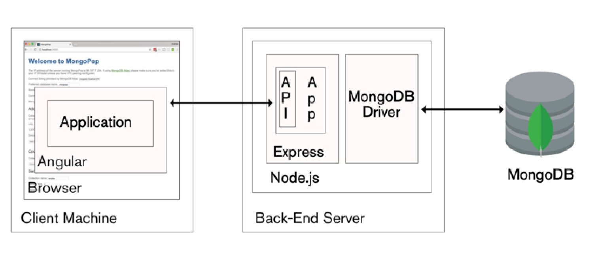

# Softwareplanung für Webprojekt WEBFR

## Architektur
MEAN Stack (MongoDB, Express, Angular, Node.js)

## Beschreibung
In diesem Projekt nutzen wir den MEAN Stack, um eine Full-Stack-Anwendung zu erstellen, die den Nutzern folgende Möglichkeiten bietet:
- Registrierung
- Login
- Einsicht in die Highscore-Liste eines fiktiven Spiels

## Frontend
- **Technologie:** Angular
- **Seiten/Komponenten:** Registrierung, Login, Highscores
- **Funktionalität:** Benutzeroberfläche zur Interaktion mit dem Backend

## Backend-Server
- **Technologie:** Node.js mit Express
- **Funktionalität:** Benutzerregistrierung, Login, Verwaltung der Highscores
- **Endpunkte:** Siehe `open-api-specification.json`

## Datenbank
- **Technologie:** MongoDB
- **Collections:**
  - `users` (username, password, firma, street, city, plz)
  - `highscores` (username, score)
- **Funktionalität:** Speicherung und Abruf von Nutzerdaten und Highscores

## Kommunikation
- Das Frontend verwendet Angular Services, um HTTP-Anfragen im JSON-Format an die Backend-API zu senden.
- Das Backend verarbeitet diese Anfragen über Express-Routen und interagiert mit der MongoDB-Datenbank zur Speicherung und Abfrage von Daten.
- Die Datenbank speichert Benutzer- und Highscore-Daten und ermöglicht deren Abfrage und Manipulation durch das Backend.

